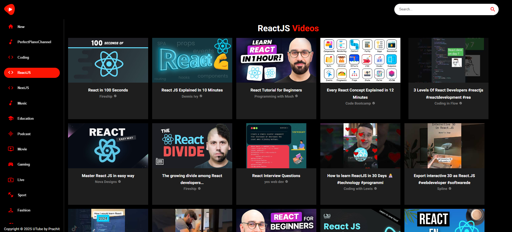

# React UTube - A YouTube Clone



---

UTube is a YouTube clone developed by Prachit and hosted on Vercel. One of the standout features of UTube is its effective utilization of MaterialUI, which provides a visually appealing and intuitive interface for users to navigate. Additionally, the clone was built using ReactJS, a powerful JavaScript library for building user interfaces, which allows for greater flexibility and customization. Overall, UTube is a great example of a well-designed and functional video sharing platform that has taken advantage of the latest web development technologies.

## Folder Structure

```js
src/
 ├─ components/
 │   ├─ ChannelCard.jsx
 │   ├─ ChannelDetail.jsx
 │   ├─ Feed.jsx
 │   ├─ index.js
 │   ├─ Loader.jsx
 │   ├─ Navbar.jsx
 │   ├─ SearchBar.jsx
 │   ├─ SearchFeed.jsx
 │   ├─ SideBar.jsx
 │   ├─ VideoCard.jsx
 │   ├─ VideoDetail.jsx
 │   ├─ Videos.jsx
 ├─ utils/
 │   ├─ constants.jsx
 │   ├─ fetchFromAPI.js
 ├─ App.css
 ├─ App.jsx
 ├─ index.css
 ├─ main.jsx
eslint.config.js
index.html
package-lock.json
package.json
vite.config.ts
```
## ⚙️ Installation

Clone the repository:

```bash
git clone https://github.com/prachit082/React-UTube.git
cd React-UTube
```
Install dependencies:

```bash
npm install
# or
yarn install
```
Start the development server:
```bash
npm run dev
# or
yarn dev
```
### ✍️ Author
Made with ❤️ by Prachit Pandit

### 📜 License
This project is licensed under the MIT License.

